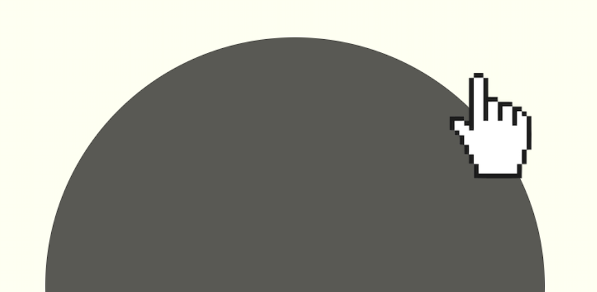

Unused ending of my [presentation](https://docs.google.com/presentation/d/1jXR04uWfTf8w5rnPxuFIPGo4QMBzkzpMs2Cbocs_ggs/edit?usp=sharing) at [PHPlive conference]() held in Ostrava and Zilina in 2018. Main puprpose was to show how rounded buttons acted like in the old days of the internet without `border-radius` CSS property and in the age of Flash, that was capable of perfecty rounded corners.

Cursors are changed to be big to make them visible also from distant seats. Interesting thing is that custom cursor in browsers has its [limitations](https://developer.mozilla.org/en-US/docs/Web/CSS/CSS_User_Interface/Using_URL_values_for_the_cursor_property/#Limitations) and is prevented to be _really_ big.
